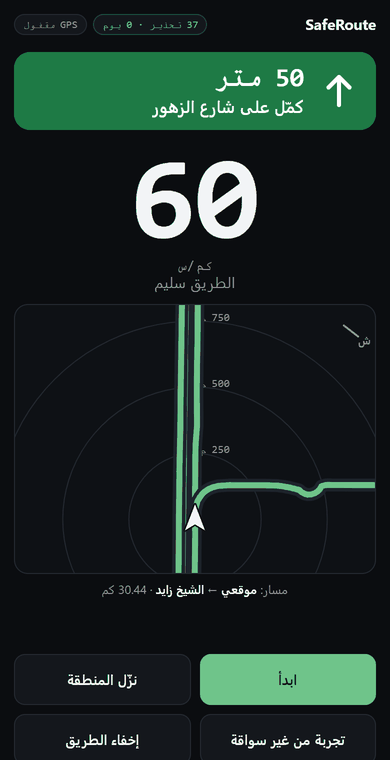
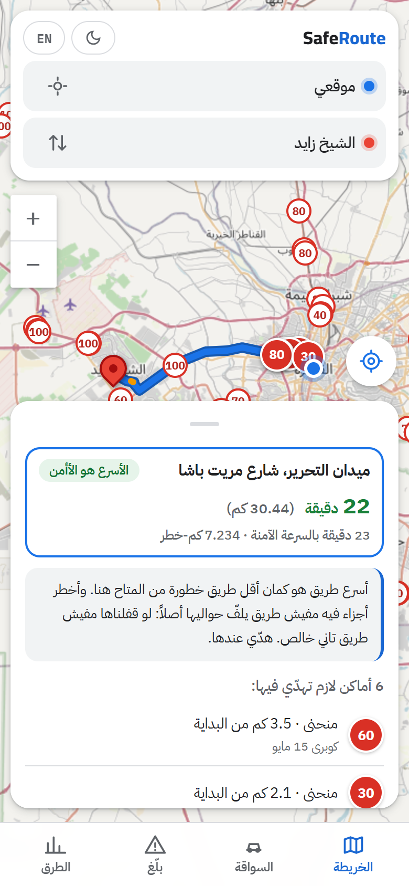
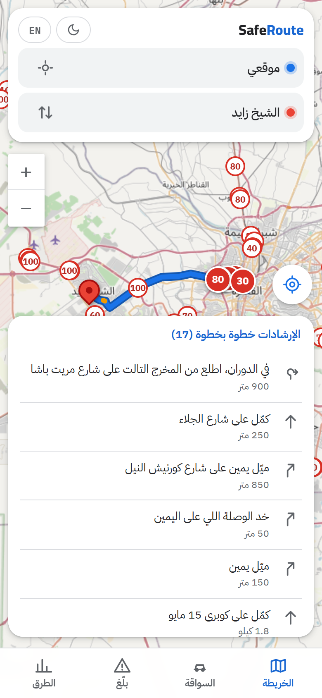
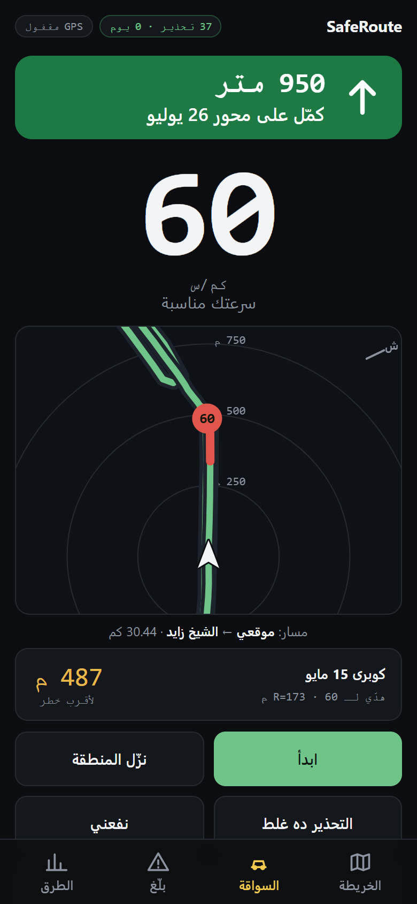
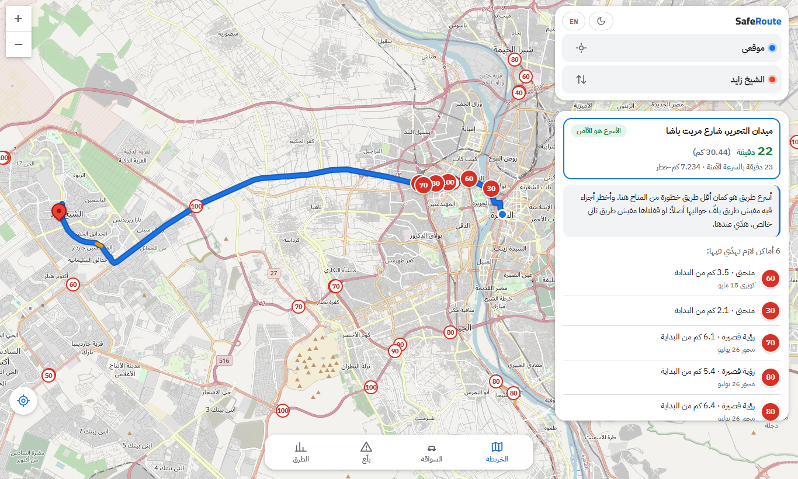
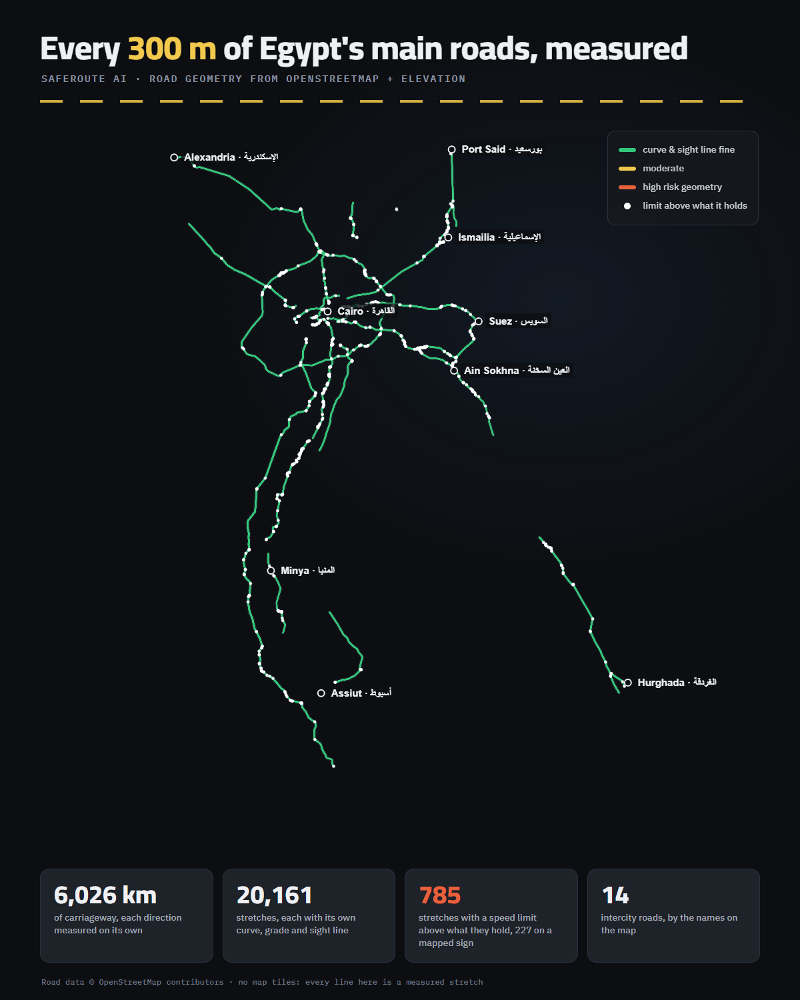
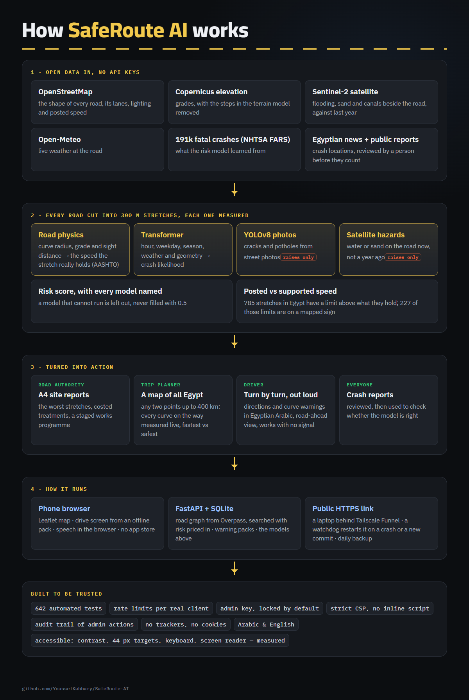

# SafeRoute AI

**Know the road before you drive it.** A map of Egypt that plans the fastest
and the safest route, measures every curve on the way, talks the driver
through it in Egyptian Arabic, and shows road authorities where the road
needs work and roughly what it would cost.

**Try it:** https://saferoute.tail88a5c1.ts.net · no install, no account, Arabic and English

  

<b>▶ 30-second video:</b> <a href="media/saferoute-demo-en.mp4">English</a> · <a href="media/saferoute-demo-ar.mp4">عربي</a>

> This repository is the project's public page: what it does, how it is built
> and what it has measured. The source code is private.
> For access or collaboration: [Youssef Kabbary on LinkedIn](https://www.linkedin.com/in/youssef-kabbary/).

## The idea

Every road in Egypt should show its potholes, cracks and dangerous curves
before anyone drives on it, and the authority responsible should see the same
thing, with a rough repair cost.

Satellite images alone cannot see a pothole, so the work is split:

- **People** photograph potholes and cracks; an AI model assesses each photo
  and adds it to that stretch of road.
- **Maps and satellite data** find the dangerous curves and turns, and check
  whether the speed limit on them is one the road can actually hold.

The app is built to be improved by the people who use it: photograph the road
and say what is wrong with it.

## What it does

| | |
|---|---|
| **A map of all Egypt** | Any trip up to 400 km. The roads on the way are measured while the route is planned; the fastest and the safest route are shown side by side. |
| **Turn by turn, out loud** | Directions and curve warnings spoken in Egyptian Arabic, before each turn and again at it. A curve warning always goes first. |
| **Works without signal** | The drive screen runs from a pack downloaded before the trip, and draws the measured road ahead on the phone. |
| **Road reports** | Crash reports and photos of road defects; photos are assessed by AI, crash reports are reviewed by a person before they count. |
| **For road authorities** | A4 site reports in Arabic and English: the most dangerous spots, treatments from published crash-modification factors, a rough cost. |

  
  &nbsp;
  
  &nbsp;
  

## Egypt's main roads, measured

Fourteen intercity roads, 6,026 km of carriageway, cut into 20,161 stretches
of 300 m and measured one by one: curve radius, grade and sight distance.
785 stretches have a speed limit above what their geometry holds; 227 of those
limits are on a mapped sign.

## How it is built

- **Risk signals:** AASHTO road physics; a Transformer trained on 191k real fatal
  crashes (AUC 0.628 on 47 held-out locations); Sentinel-2 satellite hazards
  compared with the same road a year earlier; YOLOv8 pavement defects from
  photos. A model that cannot run is left out, never filled in with a guess.
- **Stack:** Python, FastAPI, SQLite, PyTorch, OpenStreetMap, Copernicus
  elevation, Sentinel-2, Leaflet, a web app that works offline on the phone.
- **Built to be trusted:** 645 automated tests; audited with 61 checks against
  the running server; strict Content-Security-Policy; no trackers, no cookies;
  accessibility measured in a real browser (contrast, 44 px targets, keyboard,
  screen reader).

## Honest limits

- The risk model learned from US crashes. It stays marked "insufficient" until
  30 reviewed Egyptian crashes exist.
- Directions were verified in a simulated drive (Tahrir → Sheikh Zayed, 30 km,
  17 directions spoken in order); testing in a real car is next.
- It is a web page: the screen must stay on and the phone must sit in a cradle.

---

© 2026 Youssef Kabbary. All rights reserved. See [LICENSE](LICENSE).
